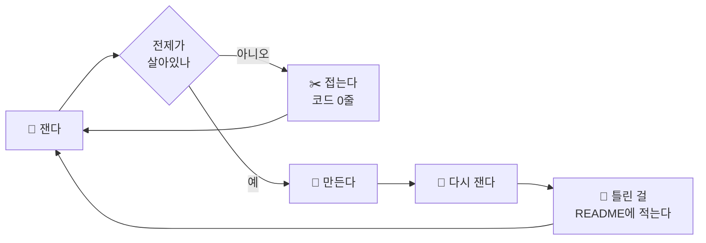

<div align="center">

# serenwoon

### 재고 나서 씁니다

**만들기 전에 잴 방법을 먼저 만듭니다. 재보고 접은 쪽이 더 많습니다.**

<br>


</div>

---

## 🤖 AI로 일하는 방식을 만듭니다

관심만 있는 게 아니라 **하네스를 직접 짭니다.** 슬래시 커맨드 15개, 역할 프롬프트 16개, 사람이 단계마다 게이트를 서는 파이프라인 하나.

```bash
/jx-track        # 트랙 브리핑을 파트너 관점으로 해부한다 (아이디어 금지)
/jx-common       # 다른 팀이 낼 답을 먼저 뽑아 금지목록에 넣는다
/jx-skeptic      # 후보를 하나씩 독립적으로 공격한다 (장점 금지)
/jx-consistency  # 산출물 전체를 기계적으로 대조한다
```

에이전트에게 "잘 해줘"라고 하지 않습니다. **무엇을 하지 말라고 적고, 결과를 다시 셉니다.**

<br>



실전 6회에 배포 1 · 접힘 5. **그중 4건은 코드를 한 줄도 안 썼습니다.**

---

## 📦 만든 것

| | 무엇 | 재보니 |
|---|---|---|
| **[ledger-reconcile](https://github.com/serenwoon/ledger-reconcile)** | 원장 이관이 맞는지 재는 하네스 | 결함 11종 중 **7종이 집계 대조를 그냥 통과** |
| **[edit-receipt](https://github.com/serenwoon/edit-receipt)** | 일괄 편집에 영수증을 붙인다 | 만든 날 **자기 README 고치다 자기한테 걸림** |
| **[spaced-quiz](https://github.com/serenwoon/spaced-quiz)** | 노트 문항을 간격 반복으로 | 문항 수가 세는 법마다 **723 / 781 / 722 / 686** |
| **[wikilink-audit](https://github.com/serenwoon/wikilink-audit)** | 볼트의 깨진 링크 | 정밀도 **0.19 → 1.00 → 0.980** |
| **[extraction-benchmark](https://github.com/serenwoon/extraction-benchmark)** | 사람 대 파이프라인 | 60초 → 8.6초, **단서는 양쪽 다 놓침** |

<sub>👉 전부 실패를 지우지 않고 README에 남겨뒀습니다. 숫자가 나빠진 것도요.</sub>

---

## 🏆 Solar for Bid — JunctionX Korea 2026

[**Team soft icecream**](https://github.com/Yonghyun-Lee-Ryan/JunctionX-Korea-Soft-Icecream) · Upstage 트랙 · 기획과 AI 파이프라인 담당 (팀 80커밋 중 48)

나라장터 공고를 읽어 **입찰 가능한 것만 추리고**, 요구사항 체크리스트 · WBS · 임계경로 · 제출물 목록까지 냅니다.

> 입찰은 서류 한 장이 빠지면 그 자리에서 실격이라 **"아마 맞을 겁니다"는 값이 0**입니다.
> 그래서 화면의 모든 숫자가 출처 문서와 쪽수를 달고 다니고, 못 읽은 칸은 0으로 채우지 않습니다.

모델이 금지 표현 **0곳**이라고 한 원고를 백엔드가 쪽 단위로 다시 훑으니 **3곳**이 나왔습니다. 그래서 판정마다 다시 셉니다.

---

<div align="center">

### 시험이 지키는 것과 지켜야 하는 것은 다른 문제입니다

<sub>한 규칙을 네 번 고치는 동안 시험은 매번 초록불이었고,<br>마지막에 전체 검토를 돌리니 그 규칙 자체가 틀렸다고 나왔습니다.</sub>

<br>

[](https://github.com/serenwoon?tab=repositories)
[](https://github.com/serenwoon?tab=repositories)
[](https://github.com/serenwoon/ledger-reconcile)
[](mailto:wjddns5161@gmail.com)

</div>
