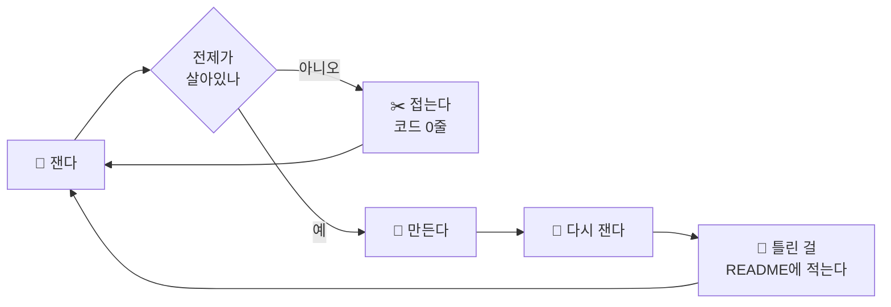
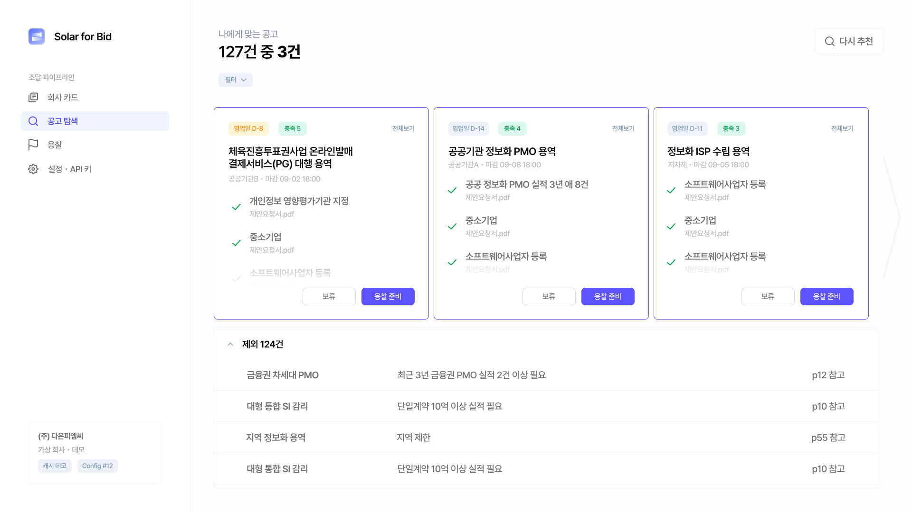
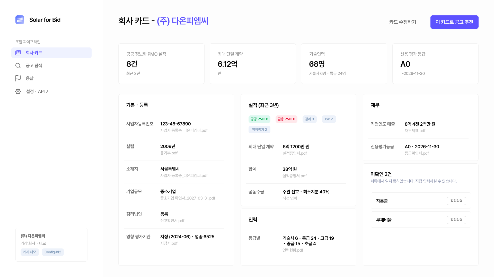
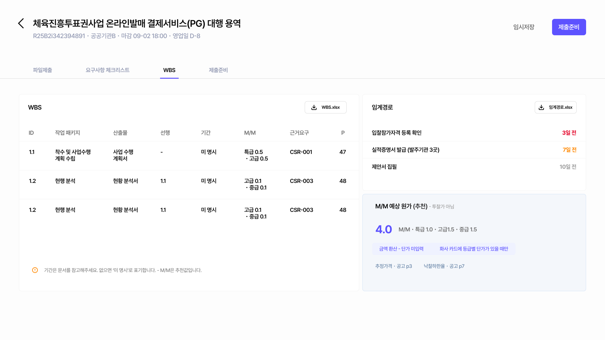
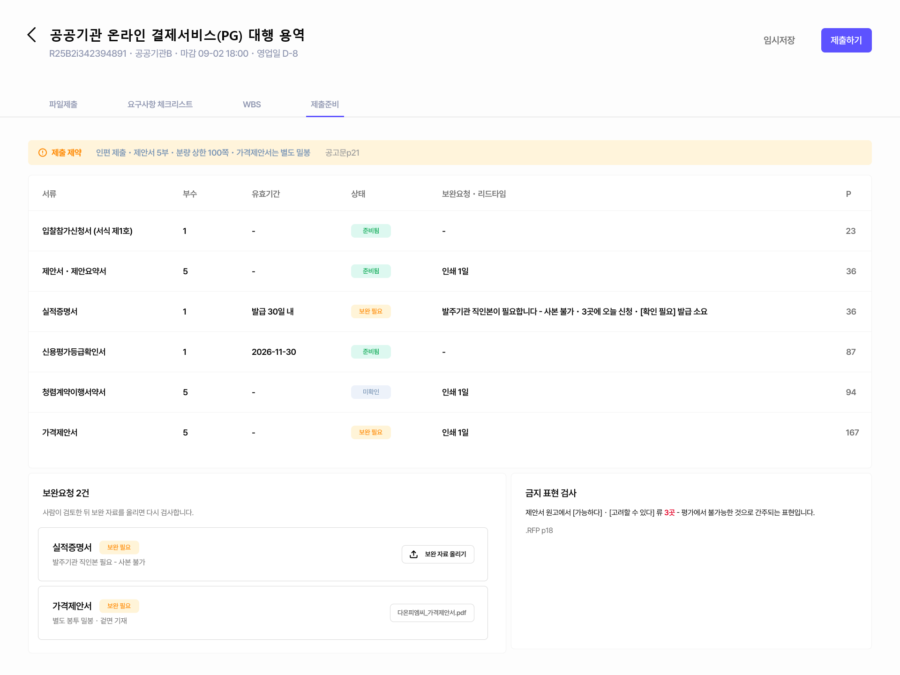
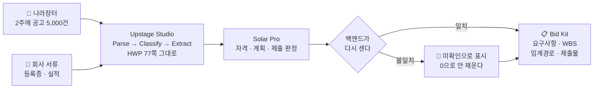

<div align="center">


I build agent harnesses for document-heavy work
(proposals, public bids, RFPs) and measure whether they actually hold.

### I kill more projects than I ship.

<sub>Six of the last eight died in the measurement, before a line of code.<br>One of them when a single grep showed 299 of 300 cases were already covered.</sub>


<br>


</div>

---

## 🤖 AI로 일하는 방식을 만듭니다

관심만 있는 게 아니라 **하네스를 직접 짭니다.** 슬래시 커맨드 15개, 역할 프롬프트 16개, 사람이 단계마다 게이트를 서는 파이프라인 하나.

```bash
/jx-track        # 트랙 브리핑을 파트너 관점으로 해부한다 (아이디어 금지)
/jx-common       # 다른 팀이 낼 답을 먼저 뽑아 금지목록에 넣는다
/jx-skeptic      # 후보를 하나씩 독립적으로 공격한다 (장점 금지)
/jx-consistency  # 산출물 전체를 기계적으로 대조한다
```

에이전트에게 "잘 해줘"라고 하지 않습니다. **무엇을 하지 말라고 적고, 결과를 다시 셉니다.**

<br>



실전 여덟 건에 배포 하나. **여섯 건은 코드를 한 줄도 안 썼고 다섯은 판단 게이트에서 죽었습니다.**

---

<div align="center">


</div>

## 📦 만든 것

| | 무엇 | 재보니 |
|---|---|---|
| [ledger-reconcile](https://github.com/serenwoon/ledger-reconcile) | 원장 이관이 맞는지 재는 하네스 | 결함 11종 중 **7종이 집계 대조를 그냥 통과** |
| [edit-receipt](https://github.com/serenwoon/edit-receipt) | 일괄 편집에 영수증을 붙인다 | 만든 날 **자기 README 고치다 자기한테 걸림** |
| [spaced-quiz](https://github.com/serenwoon/spaced-quiz) | 노트 문항을 간격 반복으로 | 문항 수가 세는 법마다 **723 / 781 / 722 / 686** |
| [wikilink-audit](https://github.com/serenwoon/wikilink-audit) | 볼트의 깨진 링크 | 정밀도 **0.19 → 1.00 → 0.980** |
| [extraction-benchmark](https://github.com/serenwoon/extraction-benchmark) | 사람 대 파이프라인 | 60초 → 8.6초, **단서는 양쪽 다 놓침** |

<sub>👉 전부 실패를 지우지 않고 README에 남겨뒀습니다. 숫자가 나빠진 것도요.</sub>

---

## 🏆 Solar for Bid — JunctionX Korea 2026

[**Team soft icecream**](https://github.com/Yonghyun-Lee-Ryan/JunctionX-Korea-Soft-Icecream) · Upstage 트랙 · 기획과 AI 파이프라인 담당 (팀 80커밋 중 48)

나라장터 공고를 읽어 입찰 가능한 것만 추리고, 요구사항 체크리스트 · WBS · 임계경로 · 제출물 목록까지 냅니다.




<sub>추천 3건 옆에 뺀 124건의 이유가 근거 쪽과 함께 붙어 있습니다. 회사와 공고 판정은 데모용 가상 데이터입니다.<br>화면 디자인은 팀 디자이너 Yejin Joo, 화면에 박힌 판정 규칙과 데모 데이터는 제 기획 문서에서 왔습니다.</sub>

<details>
<summary>화면 세 장 더 — 회사 카드 · WBS와 임계경로 · 제출 준비</summary>

<br>



읽지 못한 칸은 0으로 채우지 않고 미확인으로 남긴 뒤 사람이 넣습니다.



기간이 문서에 없으면 비워두지 않고 "미 명시"로 적습니다. 원가는 M/M까지만 내고 투찰가는 만들지 않습니다.



부수 · 유효기간 · 보완 리드타임, 그리고 금지 표현 검사입니다. 인편 제출과 분량 상한 같은 제약도 공고문 쪽수를 달고 옵니다.

</details>



한 건에 Studio 잡 6회 · Solar 6회. 콜드런 10분 22초, 캐시 4분 11초입니다.

> 입찰은 서류 한 장이 빠지면 그 자리에서 실격이라 **"아마 맞을 겁니다"는 값이 0**입니다.
> 그래서 판정마다 근거 문서와 쪽을 달게 했고, 못 읽은 칸은 0으로 채우지 않게 했습니다.

모델이 금지 표현 0곳이라고 한 원고를 백엔드가 쪽 단위로 다시 훑으니 3곳이 나왔습니다. 판정은 전부 두 번 셉니다.

화면에 박힌 규칙은 제가 쓴 기획 문서에서 그대로 왔습니다. 모든 판정에 근거 페이지를 붙인다, 못 읽은 칸은 미확인으로 남긴다, 투찰가는 만들지 않는다.

지켜지지 않은 자리도 그대로 둡니다. 저 헤드라인 "127건 중 3건"은 픽스처에 박힌 상수(`screening.demo.json`)라서 출처가 없고, 그건 제가 쓴 "출처 없는 숫자 금지"에 정면으로 걸립니다. 대회 중에 걸린 걸 적어만 두고 못 고쳤습니다.

반대로 간 자리도 있습니다. 목업의 드롭존은 다섯 형식을 약속하는데, 코드는 그 약속을 되풀이하지 않고 허용 목록에서 문구를 만들어 "PDF · HWP・HWPX・JPG・PNG는 준비 중"을 띄웁니다.

---

<div align="center">

<a href="mailto:wjddns5161@gmail.com"></a>


</div>
