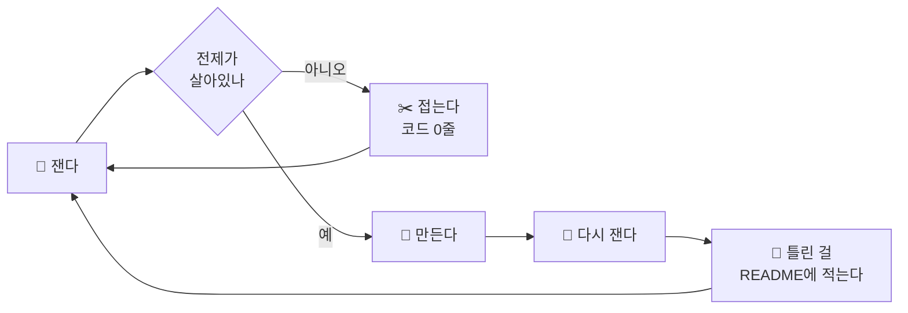
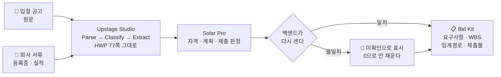

<div align="center">


I build agent harnesses for document-heavy work
(proposals, public bids, RFPs) and measure whether they actually hold.

### I kill more projects than I ship.

<sub>Six of the last eight ended before a line of code. Five were killed by the measurement itself.<br>One of them when a single grep showed 299 of 300 cases were already covered.</sub>


<br>


</div>

---

## 🤖 AI로 일하는 방식을 만듭니다

**하네스를 직접 짭니다.** 슬래시 커맨드 15개, 역할 프롬프트 16개, 사람이 단계마다 게이트를 서는 파이프라인 하나.

```bash
/jx-track        # 트랙 브리핑을 파트너 관점으로 해부한다 (아이디어 금지)
/jx-common       # 다른 팀이 낼 답을 먼저 뽑아 금지목록에 넣는다
/jx-skeptic      # 후보를 하나씩 독립적으로 공격한다 (장점 금지)
/jx-consistency  # 산출물 전체를 기계적으로 대조한다
```

에이전트에게 "잘 해줘"라고 하지 않습니다. **무엇을 하지 말라고 적고, 결과를 다시 셉니다.**

<br>


```mermaid
flowchart LR
    A["📏 잰다"] --> B{"전제가<br/>살아있나"}
    B -->|아니오| C["✂️ 접는다<br/>코드 0줄"]
    B -->|예| D["🔨 만든다"]
    D --> E["📏 다시 잰다"]
    E --> F["📝 틀린 걸<br/>README에 적는다"]
    F --> A
    C --> A
```

실전 여덟 건에 배포 하나. **여섯 건은 코드를 한 줄도 안 썼고 다섯은 판단 게이트에서 죽었습니다.**

---

<div align="center">


</div>

| 프로젝트 저장소 | 파이썬 | 테스트 | 테스트를 둔 저장소 |
|:---:|:---:|:---:|:---:|
| 13개 · 공개 10 | 15,972줄 | 616개 | 13개 중 **9개** |

<sub>2026-08-26 직접 센 값입니다. `find . -name '*.py' -not -path '*/.claude/*' -not -path '*/runs/*' | xargs cat | wc -l` · `grep -rhoE '^\s*def test_' | wc -l`.<br>하루 전에는 두 경로를 안 빼고 세서 21,257줄·826개로 적었습니다. 워크트리 사본이 한 저장소를 세 번 세고 `runs/` 아래에 딴 저장소 코드가 들어 있었습니다. 나머지 네 개에는 테스트가 없습니다.</sub>

## 📦 만든 것

| | 무엇 | 재보니 |
|---|---|---|
| [ledger-reconcile](https://github.com/serenwoon/ledger-reconcile) | 원장 이관이 맞는지 재는 하네스 | 결함 11종 중 **7종이 집계 대조를 그냥 통과** |
| [edit-receipt](https://github.com/serenwoon/edit-receipt) | 일괄 편집에 영수증을 붙인다 | 만든 날 **자기 README 고치다 자기한테 걸림** |
| [spaced-quiz](https://github.com/serenwoon/spaced-quiz) | 노트 문항을 간격 반복으로 | 문항 수가 세는 법마다 **723 / 781 / 722 / 686** |
| [wikilink-audit](https://github.com/serenwoon/wikilink-audit) | 볼트의 깨진 링크 | 정밀도 **0.19 → 1.00 → 0.980** |
| [extraction-benchmark](https://github.com/serenwoon/extraction-benchmark) | 사람 대 파이프라인 | 60초 → 8.6초, **단서는 양쪽 다 놓침** |
| [hiring-traps](https://github.com/serenwoon/hiring-traps) | Upstage Studio를 재본 기록 | 노드 **14종 중 4종만 쓰인다** |
| [quote-review](https://github.com/serenwoon/quote-review) | hiring-traps의 인용 793칸을 사람이 보는 화면 · [배포](https://serenwoon.github.io/quote-review/) | 무작위 스무 칸 중 **넷이 격자와 갈림**, 둘은 격자가 못 보는 종류 |

<sub>👉 전부 실패를 지우지 않고 README에 남겨뒀습니다. 숫자가 나빠진 것도요.</sub>

---

## Solar for Bid — JunctionX Korea 2026

4인 팀 · Upstage 트랙 · 기획과 AI 파이프라인 담당

회사 서류를 한 번 올려 두면, 고른 입찰 공고마다 참가 자격 판정과 요구사항 체크리스트 · WBS · 임계경로 · 제출물 목록을 근거 쪽과 함께 냅니다.


읽지 못한 칸은 0으로 채우지 않고 미확인으로 남긴 뒤 사람이 넣습니다. 기간이 문서에 없으면 비워두지 않고 "미 명시"로 적습니다. 원가는 M/M까지만 내고 투찰가는 만들지 않습니다.


```mermaid
flowchart LR
    N["📢 입찰 공고<br/>원문"] --> S
    C["🏢 회사 서류<br/>등록증 · 실적"] --> S
    S["Upstage Studio<br/>Parse → Classify → Extract<br/>HWP 77쪽 그대로"] --> J
    J["Solar Pro<br/>자격 · 계획 · 제출 판정"] --> G
    G{"백엔드가<br/>다시 센다"} -->|"불일치"| G2["🚩 미확인으로 표시<br/>0으로 안 채운다"]
    G -->|"일치"| K["📋 Bid Kit<br/>요구사항 · WBS<br/>임계경로 · 제출물"]
    G2 --> K
```

한 건에 Studio 잡 6회 · Solar 6회. 캐시를 쓰면 한 건에 약 4분이 걸렸습니다.

> 입찰은 서류 한 장이 빠져도 탈락할 수 있어서 **"아마 맞을 겁니다"는 값이 0**입니다.
> 그래서 판정마다 근거 문서와 쪽을 달게 했고, 못 읽은 칸은 0으로 채우지 않게 했습니다.

피해야 할 표현 세 곳을 일부러 넣은 가상 원고를 모델은 0곳이라고 돌려줬고, 백엔드에 쪽 단위 검사를 더하자 세 곳이 모두 잡혔습니다. 판정은 전부 두 번 셉니다.

화면에 박힌 규칙은 제가 쓴 기획 문서에서 그대로 왔습니다. 모든 판정에 근거 페이지를 붙인다, 못 읽은 칸은 미확인으로 남긴다, 투찰가는 만들지 않는다.

---

<div align="center">

<a href="mailto:wjddns5161@gmail.com"></a>


</div>
