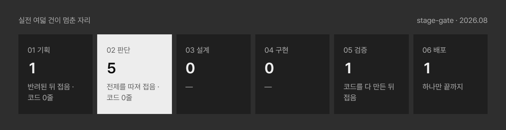
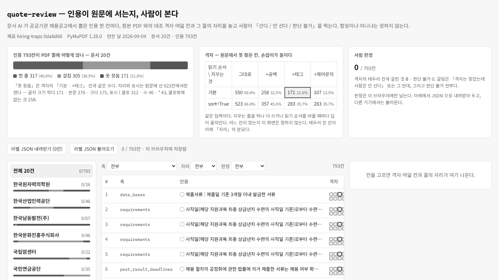
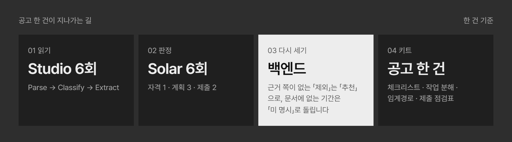

I build agent harnesses for document-heavy work and measure whether they actually hold.

문서를 다루는 일을 에이전트로 돌리고 그 결과가 정말 맞는지 재는 하네스를 만듭니다. 결과를 내기 전에 맞고 틀림을 가릴 방법부터 마련합니다. 코드는 주로 Claude Code가 쓰고 저는 무엇을 잴지 정한 다음 나온 결과를 다시 셉니다.

화면과 그림을 붙인 열다섯 장짜리 포트폴리오는 [**serenwoon.github.io/portfolio**](https://serenwoon.github.io/portfolio/)에 있습니다. 바로 열어 볼 수 있는 것은 [quote-review](https://serenwoon.github.io/quote-review/), [g2b-daily](https://serenwoon.github.io/g2b-daily/), [star-voyage](https://star-voyage-sooty.vercel.app), [star-cards](https://star-cards-tau.vercel.app), [다시, 한 걸음](https://one-step-beta.vercel.app) 다섯입니다.

---

### I kill more projects than I ship.

Of eight pipeline runs in August 2026, one shipped. Six ended before a line of code, five of them at the judgment gate. One of those five ended when a count showed that a one-line grep already covered 299 of 300 tagged notes.

<picture>
  <source media="(prefers-color-scheme: dark)" srcset="assets/bw-gate-runs-dark.png">
  <source media="(prefers-color-scheme: light)" srcset="assets/bw-gate-runs-light.png">
  
</picture>

2026년 8월에 비공개 파이프라인 stage-gate로 실전 여덟 건을 돌렸고 배포까지 간 것은 하나입니다. 여섯 건은 코드를 한 줄도 안 썼고 그중 다섯은 판단 게이트에서 죽었습니다.

에이전트에게 "잘 해줘"라고 하지 않습니다. 무엇을 하지 말라고 적고, 결과를 다시 셉니다.

## Featured 대표작

[quote-review](https://github.com/serenwoon/quote-review) · [화면 열기](https://serenwoon.github.io/quote-review/) 
인용 793칸이 원본 PDF에 실제로 있는지 사람이 한 칸씩 확인하는 화면입니다. 인용은 문서 AI가 공공기관 채용공고에서 뽑았습니다. 화면은 인용마다 PDF에서 읽은 글자와 기계로 맞춰 본 결과를 여덟 칸 격자로 보여 줍니다. 무작위 스무 칸 중 넷이 격자와 어긋났는데 그중 둘은 격자가 잡을 수 없는 종류였습니다. 스무 칸은 표본일 뿐이고 793칸의 사람 판정은 아직 0입니다.

아래 셋은 같은 코퍼스에서 먼저 잰 것입니다.

[hiring-traps](https://github.com/serenwoon/hiring-traps) 
공공기관 채용공고 20건으로 Upstage Studio를 시험해 봤습니다. 제 에이전트 19개는 노드 14종 가운데 4종을 썼습니다. 같은 문서를 두 번 넣었더니 값이 달라졌습니다.

[pdf-read-order](https://github.com/serenwoon/pdf-read-order) 
같은 PDF를 읽기 순서만 바꿔 읽었습니다. 채용공고 104건 중 94건(90.4%)에서 글자는 같은데 순서만 달라졌습니다. 처음엔 121건으로 발표했지만 사본 17건이 섞여 있어 바로잡았습니다.

[pdf-space-guess](https://github.com/serenwoon/pdf-space-guess) 
PDF에서 0.25em 이상 벌어진 자리에 공백이 안 들어가는 비율은 Type 3 글꼴이 79.0%, Type 0이 1.5%입니다. 재는 단위를 잘못 잡아 나온 99.9%를 첫 발표 뒤에 고쳤습니다.

## Harnesses 검증 하네스

[ledger-reconcile](https://github.com/serenwoon/ledger-reconcile) 
결함 열한 종을 심은 합성 원장으로 이행(마이그레이션) 검증을 네 겹으로 나눠 쟀습니다. 건수와 금액 합계만 맞춰 보고 끝내면 열한 종 중 일곱 종이 그대로 빠져나갑니다.

[wikilink-audit](https://github.com/serenwoon/wikilink-audit) 
옵시디언 위키링크가 실제로 어디로 가는지 따져서 안 가는 것만 사유를 붙여 보고합니다. 첫 실측 정밀도는 0.190이었고, 분모 정의를 바꾼 뒤 0.469, 해석기를 고친 뒤 1.00이 나왔습니다. 발표한 정밀도 1.00은 도구의 오탐 둘이 라벨에 묻힌 숫자여서 0.980으로 정정했습니다. 재현율은 재지 않았습니다.

[extraction-benchmark](https://github.com/serenwoon/extraction-benchmark) 
도로교통법 조문 10건을 사람과 파이프라인이 따로 분류하고 요약했습니다. 본문을 한정하는 단서 4건 중 요약에 살린 것은 사람 0건, LLM 0~1건이었습니다. 기계 스캔을 붙이자 4건이 모두 잡혔습니다.

[youtube-sentiment-pipeline](https://github.com/serenwoon/youtube-sentiment-pipeline) 
자동차 리뷰 댓글의 감정을 가르는 분류기를 골든셋 198건과 부트스트랩 95% 구간으로 평가했습니다. 가장 나은 SBERT도 macro F1이 0.376으로 무작위 추측(0.329)과 구분되지 않습니다.

전부 실패를 지우지 않고 README에 남겨뒀습니다. 숫자가 나빠진 것도요.

## Shipped 배포와 도구

[g2b-daily](https://github.com/serenwoon/g2b-daily) · [대시보드 열기](https://serenwoon.github.io/g2b-daily/) 
나라장터 용역 입찰공고 메타데이터를 매일 05:00(KST)에 예약 수집합니다. 수집이 불완전하면 파일을 만들지 않고 실패합니다. 2026.08.31–09.28, 29일 중 25일을 저장했습니다.

[star-voyage](https://github.com/serenwoon/star-voyage) · [사이트 열기](https://star-voyage-sooty.vercel.app) 
점성술 공부 사이트입니다. 출생 차트 휠을 지도처럼 끌고 확대하며 해설을 읽을 수 있습니다. 행성 위치를 Swiss Ephemeris 기준값과 대조해 최대 차이 0.004°를 README에 적었습니다.

[agent-workflow](https://github.com/serenwoon/agent-workflow) 
장문 문서 작업을 에이전트에 맡길 때 틀린 결과가 조용히 넘어가지 않게 판정 루프를 짰습니다. 여기 규칙은 미리 설계해 둔 것 하나 없이 전부 무언가를 틀린 다음에 생겼습니다.

[edit-receipt](https://github.com/serenwoon/edit-receipt) 
일괄 텍스트 편집에 영수증을 붙입니다. 시킨 건수와 바뀐 건수가 다르면 아무 파일도 쓰지 않습니다. 기대 건수의 기본값은 「1 이상」이 아니라 정확히 1입니다. 이 도구로 edit-receipt의 README 여덟 군데를 고치다 한 군데가 0건으로 걸렸습니다.

[spaced-quiz](https://github.com/serenwoon/spaced-quiz) 
마크다운 노트의 문항을 터미널에서 간격 반복으로 풉니다. 진도를 노트 옆 마크다운 표에 써서 기기 사이에 따라가게 합니다. 제 노트의 문항 수는 세는 방법마다 723, 781, 722, 712로 달랐습니다.

[star-cards](https://github.com/serenwoon/star-cards) · [사이트 열기](https://star-cards-tau.vercel.app) 
생년월일로 9:16 별자리 카드 일곱 장을 만들어 저장·공유하는 정적 사이트입니다. star-voyage의 계산 엔진을 그대로 씁니다.

| 위 저장소 | 파이썬 | 테스트 함수 | 파이썬 테스트를 둔 곳 |
|:---:|:---:|:---:|:---:|
| 14개 | 13,823줄 | 400개 | 14개 중 8개 |

2026-10-08에 위 공개 저장소 열넷을 다시 센 값입니다. 원격 기본 브랜치에 올라간 <code>*.py</code>의 줄 수와 <code>def test_</code> 수이고, TypeScript로 쓴 테스트(star-voyage · star-cards · quote-review)는 들어 있지 않습니다. TypeScript 테스트까지 치면 테스트를 둔 저장소는 14개 중 10개입니다. 08-26에는 비공개 셋을 낀 열세 저장소로 15,972줄 · 616개라고 적었고, 그 하루 전에는 한 저장소의 워크트리 사본 두 벌과 파이프라인 실행 폴더 <code>runs/</code>에 든 다른 저장소 코드를 안 빼고 세서 21,257줄 · 826개로 적었습니다.

아래 작업은 저장소가 비공개라 저장소 링크를 걸지 않았습니다.

`stage-gate` 
이 파이프라인은 아이디어 한 줄을 기획·판단·설계·구현·검증·배포로 끌고 갑니다. 단계마다 사람 게이트가 섭니다.

`wbs-weekly` 
엑셀 WBS 진척관리를 웹으로 옮겼습니다. 주차 스냅샷을 쌓아 지난주 대비 변화를 먼저 보여 줍니다.

`pms` 
폐쇄망 운영을 위한 프로젝트 관리 시스템입니다. 계정·권한, 대시보드, 채팅·게시판, CSV·XLSX WBS 분석을 담았습니다. 코드 작성, 검사 실행, 패키징과 배포는 Codex가 했고, 저는 만들 것을 요청하고 갈림길에서 골랐습니다. 검사 기록은 [포트폴리오의 PMS 장](https://serenwoon.github.io/portfolio/#h-pms)에 있습니다.

`policy` · `one-step-apply` 
MABC 결선작 「다시, 한 걸음」과 그 고도화 판입니다. 청년정책 탐색과 필요서류·신청 준비를 돕습니다.

## Experience 대회

[JunctionX Korea 2026 · Upstage 트랙](https://serenwoon.github.io/portfolio/#h-solar) 2026.08.21 – 08.23 
4인 팀에서 「Solar for Bid」의 기획과 AI 파이프라인을 맡았습니다.

[MABC 2026](https://one-step-beta.vercel.app) 2026.08.26 – 09.19 
개인으로 참가해 결선에 올랐고 결선작 「다시, 한 걸음」을 기획했습니다. Hermes Agent 안의 Solar Pro 4에 구현을 지시하고 검증해 포스터 세션에서 발표했습니다.

[원티드 AI Championship 2026](https://serenwoon.github.io/portfolio/#h-miri) 2026.09.06 – 09.20 
5인 팀의 데이터·배치 담당으로 대시보드 집계 쿼리를 썼습니다. 합성 로그와 숫자 대조 스크립트를 고쳐 검증한 뒤 9월 20일에 제출했습니다.

[DACON 나라장터 법령 위반 모니터링 AI 경진대회](https://serenwoon.github.io/portfolio/#h-experience) 2026.08 – 09 
파인튜닝이 금지된 고정 LLM으로 공고 한 건의 검토 항목 24개를 판정하는 파이프라인을 만들었습니다.

### Solar for Bid

JunctionX Korea 2026 · Upstage 트랙 · 4인 팀(기획·AI 파이프라인은 저, 개발 2, 디자인 1)

회사 서류를 한 번 올려 두면, 고른 입찰 공고마다 참가 자격 판정과 요구사항 체크리스트, 제출 서류 점검표를 근거 쪽과 함께 내는 문서 에이전트입니다. 저는 제품 기획서와 판정 규칙을 쓰고 Studio 에이전트를 설정했습니다.

공고 한 건은 Studio 작업 6회(Parse → Classify → Extract)로 읽고 Solar 호출 6회(자격 1 · 계획 3 · 제출 2)로 판정합니다. 백엔드가 그 판정을 다시 세어 체크리스트와 작업 분해, 임계경로, 제출 점검표를 냅니다. 다시 셀 때 근거 쪽이 없는 「제외」는 「추천」으로 돌립니다.

<picture>
  <source media="(prefers-color-scheme: dark)" srcset="assets/bw-solar-path-dark.png">
  <source media="(prefers-color-scheme: light)" srcset="assets/bw-solar-path-light.png">
  
</picture>

> 입찰은 서류 한 장이 빠져도 탈락할 수 있어서 "아마 맞을 겁니다"는 값이 0입니다.
> 그래서 판정마다 근거 문서와 쪽을 달게 했고, 못 읽은 칸은 0으로 채우지 않게 했습니다.

그 칸은 미확인으로 남긴 뒤 사람이 넣습니다. 기간이 문서에 없으면 비워두지 않고 「미 명시」로 적습니다. 원가는 M/M까지만 내고 투찰가는 만들지 않습니다.

피해야 할 표현 세 곳을 일부러 넣은 가상 문서로 시험하자 모델은 0곳을 돌려줬고, 백엔드에 쪽마다 같은 표현 목록을 찾는 검사를 더하자 세 곳이 모두 잡혔습니다. 캐시를 쓰면 공고 한 건에 약 4분이 걸렸습니다(한 번 잰 값).

08.23 12:00 마감에 최종 제출했고 배포는 없습니다. 슬라이드와 화면 디자인은 팀 디자이너가 했고, 화면 시안과 일곱 단계 파이프라인은 [포트폴리오의 Solar for Bid 세 장](https://serenwoon.github.io/portfolio/#h-solar)에 있습니다.

## Education 학력

한양대학교 ERICA 2020.03 – 2026.08 
산업인공지능학과와 ICT융합학부를 복수전공하고 2026년 8월에 졸업했습니다.

LINC 3.0 기업연계 캡스톤 2023 
4인 팀 「Slack을 이용한 데이터 리포팅」에서 댓글 수집과 Superset 대시보드, 파이프라인의 양 끝단을 맡았습니다. 감정분석은 그때 맞는지 따져 보지 않았고 2026년에 youtube-sentiment-pipeline으로 다시 만들었습니다.

## Contact 연락처

<picture>
  <source media="(prefers-color-scheme: dark)" srcset="https://capsule-render.vercel.app/api?type=wave&color=2E2E2E&height=120&section=footer">
  
</picture>
